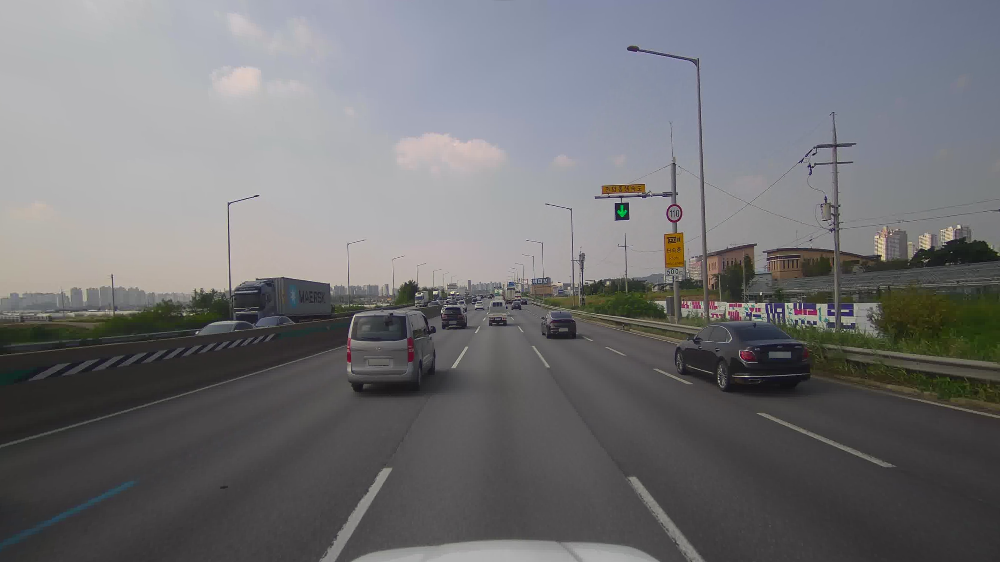

### AIHUB 전국 도로시설물 영상정보 데이터

* 설명 : 전국의 고속도로, 국도, 지방도 4.5만KM에 존재하는 도로시설물 인식 데이터 구축  

 

||전국 도로시설물 영상정보 데이터|
|-----|-----|
|다운로드|[link](https://www.aihub.or.kr/aihubdata/data/view.do?currMenu=115&topMenu=100&aihubDataSe=data&dataSetSn=71786)|
|구축년도|2023|
|용량|1.66TB|
|데이터 형식|jpg(camera)|
|데이터 수량|원천 데이터 20만장 / 라벨링 데이터 20만개|
|어노테이션|* 파일 유형 : json * 라벨링 유형 : 2D bounding box or segmentation|
|객체 종류|도로안전시설물(16종), 도로관리시설물(8종), 교통관리시설물(8종), 기타(2종)  * 바운딩박스 가공시설물 : 시선유도표지, 갈매기표지, 표지병, 장애물 표적표지, 구조물 도색 및 빗금표지, 시선유도봉, 조명시설, 도로반사경, 과속방지턱, 교통신호기, 도로표지,안전표지, 도로명판, 긴급연락시설, CCTV, 도로전광표시, 도로이정표, 기둥, 가로재 * 세그멘테이션 가공 시설물 : 중앙분리대, 방호울타리, 충격흡수시설, 낙석방지망,낙석방지울타리,낙석방지 옹벽, 식생공법, 교량 , 터널, 지하차도, 고가차도, 입체교차로, 지하보도, 육교, 정거장|
|객체 속성|주행속도, 촬영방향, 위경도, 지역, 도로구분, 도시타입, 시설물 상태정보|
|특징|비교적 가까이에 있는 데이터만 라벨링 되어있음 객체 종류가 굉장히 다양함|

 

# Object counts

|indx|class|train obj count|valid obj count|
|-----|-----|-----|-----|
| 1  | 기둥                | 495,594 | 52,876  | 
| 2  | 가로재              | 240,533 | 23,845  | 
| 3  | 시선유도표지         | 129,704 |  16,052 | 
| 4  | 갈매기표지           | 25,349 | 4,185 |
| 5  | 표지병               | 1494 | 34 |
| 6  | 장애물 표적표지       | 10,784 | 981  | 
| 7  | 구조물 도색 및 빗금표지| 59,082 | 7,320  | 
| 8  | 시선유도봉            | 82,720 | 7,663  | 
| 9  | 조명시설             | 103,736 | 11,619 |
| 10 | 도로반사경           | 5,981 | 720  |
| 11 | 과속방지턱           |  4,006 | 362 |
| 12 | 중앙분리대           | 0 | 0 |
| 13 | 방호울타리           | 0 | 0 |
| 14 | 충격흡수시설         | 0 | 0 |
| 15 | 낙석방지망           | 0 | 0 |
| 16 | 낙석방지울타리        | 0 | 0 |
| 17 | 낙석방지 옹벽        | 0 | 0 |
| 18 | 식생공법             | 0 | 0 |
| 19 | 교량                | 0 | 0 |
| 20 | 터널                | 0 | 0 |
| 21 | 지하차도             | 0 | 0 |
| 22 | 고가차도             | 0 | 0 |
| 23 | 입체교차로           | 0 | 0 |
| 24 | 지하보도             | 0 | 0 |
| 25 | 육교                | 0 | 0 |
| 26 | 정거장              | 0 | 0 |
| 27 | 교통신호기           | 56,117 | 4,580 |
| 28 | 도로 표지            | 164,432 | 16,532  |
| 29 | 안전 표지            | 19,279  | 1,839 |
| 30 | 도로명판             | 26,088  | 2,508 |
| 31 | 긴급연락시설         |  145 | 6  |
| 32 | CCTV               |  18,214  | 1,928 |
| 33 | 도로전광표시         | 10,505  | 1,238 |
| 34 | 도로이정표           |  193,165  | 20,124  |
||이미지 수| 20,000 | 160,000 |
||객체가 없는 이미지 수 | 343 | 2,917 |

--> Train 이미지 수 16만장, Valid 이미지 수 2만장으로 목표 데이터 수량보다 부족함  
--> 12~26번 라벨이 없는것으로 보아 Others 폴더에 있을 확률이 큼  
