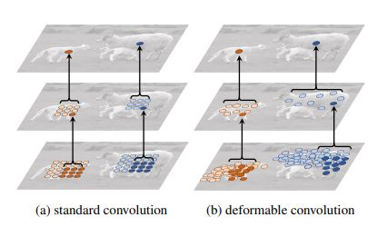
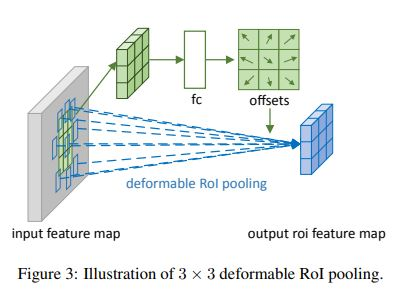

# Deformable Convolutional Networks (DCN)

* 분류 : 2D detection  
* 논문: "Deformable Convolutional Networks"
* 저자: Jifeng Dai, Haozhi Qi, Yuwen Xiong, Yi Li, Guodong Zhang, Han Hu, Yichen Wei
* 출판년도: 2017 (ICCV)
* 인용수 : 6604회
* github link : https://github.com/msracver/Deformable-ConvNets  
* 특징 : 기존 CNN이 가지는 제한적인 기하학적 변형 처리 능력을 개선하여, 비정형적이거나 다양한 형태와 크기를 가진 물체를 보다 효과적으로 처리할 수 있도록 설계된 모델임.

### 주요 특징:

1. 변형 가능한 RoI 풀링(Deformable RoI Pooling): RoI(관심 영역)를 동적으로 조정하여 물체의 정확한 위치와 경계를 더 세밀하게 탐지함.  
 

2. 변형 가능한 합성곱(Deformable Convolutions): CNN은 고정된 격자 형태로 이미지를 샘플링하는 반면, DCN은 학습된 오프셋(offset)을 통해 샘플링 위치를 동적으로 조정함. 이로 인해 물체의 형태에 맞춰 컨볼루션 커널이 그 크기와 위치를 유연하게 변경할 수 있어 더 다양한 기하학적 변형을 처리할 수 있음​.  
 

## DCNv2  

* 논문: "Deformable ConvNets v2: More Deformable, Better Results"
* 저자: Xizhou Zhu, Han Hu, Stephen Lin, Jifeng Dai
* 출판년도: 2018
* 인용수: 2323회
* github link : https://github.com/CharlesShang/DCNv2  

DCNv2에서는 모듈화된 변형 구조가 도입되어, 단순히 샘플링 위치를 조정하는 것뿐만 아니라, 각 공간 위치에서 입력 특징의 중요도를 조절할 수 있는 기능이 추가됨. 이를 통해 네트워크는 불필요한 정보를 걸러내고 더 중요한 정보에 집중할 수 있게 됨
