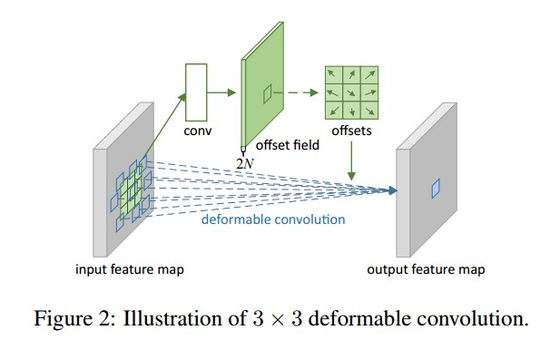
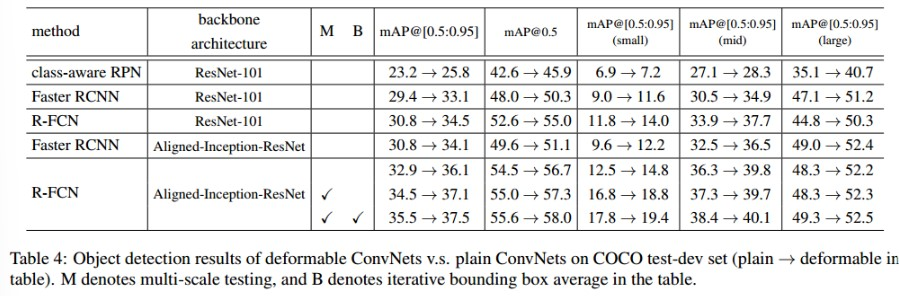
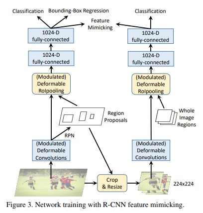
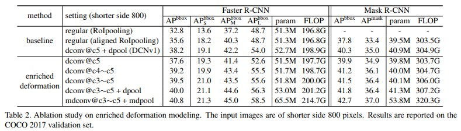

# Deformable Convolutional Networks (DCN)

* 분류 : 2D detection  
* 논문: "Deformable Convolutional Networks"
* 저자: Jifeng Dai, Haozhi Qi, Yuwen Xiong, Yi Li, Guodong Zhang, Han Hu, Yichen Wei
* 출판년도: 2017 (ICCV)
* 인용수 : 6604회
* github link : https://github.com/msracver/Deformable-ConvNets  
* 요약 : "변형 가능한(Deformable)" 합성곱과 풀링을 사용하는 모델이다. deformable하게 학습을 시키면, **기존 CNN이 가지는 제한적인 기하학적 변형 처리 능력을 개선**할 수 있다. 따라서 비정형적이거나 다양한 형태와 크기를 가진 물체를 보다 효과적으로 처리할 수 있다.

### 주요 특징

1. Deformable Convolutions  
CNN은 고정된 격자 형태로 이미지를 샘플링하는 반면, DCN은 학습된 오프셋(offset)을 통해 샘플링 위치를 동적으로 조정한다. 동적으로 conv에서 값을 추출하면 보다 더 넓은 범위에서 값을 추출하므로 trans variance를 얻을 수 있다. 이로 인해 물체의 형태에 맞춰 컨볼루션 커널이 그 크기와 위치를 유연하게 변경할 수 있어 더 다양한 기하학적 변형을 처리할 수 있다​.  

 

기존 cnn과 다르게 conv를 통과시킨 후 offset을 생성해낸다. 기존 conv는 피쳐맵에서 정해진 영역에서만 특징을 추출한다면 offset을 추가하여 좀 더 넓은 범위에서 특징을 추출할 수 있다. 또한 이 offset은 학습이 가능하다.  
   ex) 3x3 filter + offset  

 

deformable convolution은 객체에 따라 receptive field가 다르기 때문에, 고정된 영역이 아니라 객체 전체의 피쳐를 잘 뽑아낼 수 있다.  

2. Deformable RoI Pooling  
RoI(관심영역)를 동적으로 조정하여 물체의 정확한 위치와 경계를 더 세밀하게 탐지한다.  

 

RoI pooling으로 피쳐맵을 생성한 후 fc layer를 통과시켜 offset을 생성한다. 그리고 offset을 활용하여 deformable RoI pooling을 수행해 아웃풋 피쳐맵을 생성한다. 이 기법을 사용하면 좀 더 중요한 정보를 가지고 있는 관심 영역을 지정할 수 있다.  

※ deformable conv와의 차이점 : offset을 fully connected layer로 계산  

### 성능 향상  

 

## DCNv2  

* 논문: "Deformable ConvNets v2: More Deformable, Better Results"
* 저자: Xizhou Zhu, Han Hu, Stephen Lin, Jifeng Dai
* 출판년도: 2018
* 인용수: 2323회
* github link : https://github.com/CharlesShang/DCNv2  
* 요약 : DCNv2에서는 모듈화된 변형 구조가 도입되어, 단순히 샘플링 위치를 조정하는 것뿐만 아니라, 각 공간 위치에서 입력 특징의 중요도를 조절할 수 있는 기능이 추가됨. 이를 통해 네트워크는 불필요한 정보를 걸러내고 더 중요한 정보에 집중할 수 있게 됨  

### DCNv1의 한계  

RoI를 벗어나 객체의 특징과 관계 없는 영역까지 검출 될 수 있음  

### 주요 특징  

1. Stacking More Deformable Conv Layers  
DCNv1보다 더 많은 conv layer를 deformable conv layer로 대체하여, 네트워크 전체의 기하학적 적응 능력을 향상 시킨다. DCNv1은 ResNet-50의 conv5 단계에만 3개의 deformable convolution을 적용했다. DCNv2는 ResNet-50의 conv3, conv4, conv5 단계의 모든 3×3 conv 계층에 deformable convolution을 적용했다. DCNv1는 총 3개의 deformable conv를 갖고, DCNv2는 총 12개를 갖는다. 

2. Modulated Deformable Modules  

DCNv1는 offset을 사용해서 각 픽셀에서 입력 특징의 위치를 조정하는 데 초점이 있었다. 하지만 이렇게만 하면 네트워크가 어떤 공간 위치를 중요하게 보거나 덜 중요하게 볼지 스스로 결정하기 어렵다.  
modulated Deformable Modules는 여기에 추가로 **특정 위치의 중요도(Amplitude)**를 학습할 수 있는 기능을 더해준다. 어떤 위치가 분석에 필요 없다고 판단되면, 해당 위치의 중요도를 0으로 설정하여 완전히 무시할 수 있다. amplitude는 특정 위치를 얼마나 중요하게 볼지를 결정하며, [0, 1] 사이의 모듈화 스칼라값을 가진다.   

* modulated deformable convolution : 입력 피쳐에서 offset을 구한 후 각 특징 값에 모듈화 스칼라를 곱한 후, 기중치와 함께 합산하여 최종 출력을 만든다.
* modulated deformable RoIPooling : RoI를 K개의 공간 bin으로 나누고, 각 bin 내부의 특징을 균등하게 샘플링 후 평균화하여 출력을 계산한다. 

결과적으로 RoI 내에서 중요한 부분에 더 초점을 맞추고, 덜 중요한 부분은 무시할 수 있게 된다.  

3. R-CNN Feature Mimicking  
teacher로 R-CNN 사용했다. R-CNN은 입력된 cropped image에 대해 분류하기 위해 학습된 신경망이기 때문에 배경 정보가 적기 때문에 RoI 이외의 정보에는 영향을 받지 않는다. 따라서 DCNv2는 feature mimicking loss를 추가함으로써, RoI 특징을 R-CNN의 cropped image의 특징과 유사하게 만들어 특징 추출 능력 향상을 도모한다.

 

### 성능 향상  

학습 가능한 offset과 scalr를 도입해 공간적 위치별로 특징 추출의 중요도를 조정 가능하다. 추가된 계층으로 인해 계산 비용 증가가 최소화되며, 전체 네트워크 효율성을 유지할 수 있다. 또한 초기 파라미터와 학습률 설정이 신중히 조정되어 안정적인 학습이 가능하다.

 

