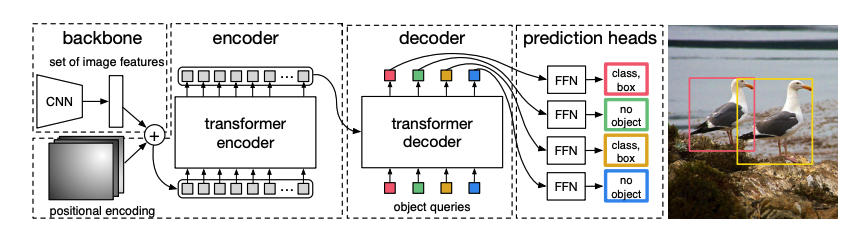

# End-to-End Object Detection with Transformers

* 분류: 2D Detection
* 저자: Nicolas Carion, Francisco Massa, Gabriel Synnaeve, Nicolas Usunier, Alexander Kirillov, and Sergey Zagoruykos
Facebook AI
* Cited by 13,907
* Thu, 28 May 2020 
* 논문주소: https://arxiv.org/abs/2005.12872
* 소스코드: https://github.com/facebookresearch/detr

## The DETR Model

* Object detection set prediciton loss

DETR 고정된 N predictions를 추론.
N은 한 이미지안에 들어갈 수 있는 전형적인 Object 수 보다 크게 설정.
Hungarian Loss를 사용하여 결과와 매칭

$\hat{\sigma}=\underset{\sigma\in\mathfrak{S}_N}\argmin\displaystyle\sum_i^NL_{match}(y_i,\hat{y}_{\sigma(i)})$

$L_{match}(y_i,\hat{y}_{\sigma(i)}) = -\mathbb{1}_{\{c_i\ne\emptyset\}}\hat{p}_{\sigma(i)}(c_i)+\mathbb{1}_{\{c_i\ne\emptyset\}}L_{box}(b_i,\hat{b}_{\sigma(i)})$

$L_{hungarian}(y, \hat{y})=\displaystyle\sum_{i=1}^{N}[-log\hat{p}_{\hat{\sigma}(i)}(c_i)+1_{\{c_i\ne{\emptyset}\}}L_{box}(b_i,\hat{b}_{\hat{\sigma}}(i))]$

### DETR Architecture

 

* Backbone

CNN Backbone 사용 일반적으로 마지막 activation map으로 C = 2048, H = h/32, W = w/32 형태를 사용.
 
* Transformer encoder

Backbone 에서 받은 activation map의 C channel을 d demension으로 변환
output으로 d x HW feature map을 생성
Transformer의 특성상 permutation invariant하기 때문에 이미지의 위치 정보를 보충하기위해 고정된 Positialnal Encoding을 사용

* Transformer decoder

size d의 N개의 Embeddings을 사용

학습된 Positional Encoding 여기서 Object queries라고 불리는 input을 사용

이 N개의 Object queries가 독립적으로 decode 되고 feed forward network를 통과하여 box coordinates와 class labels을 예측

* Prediction feed-forward networks (FFNs)

ReLU activation과 dimension d인 3-layer perceptron과 linear projection layer로 구성되어있음

Box에 대한 normalize된 중심 좌표, height, width를 예측

∅ 라는 클래스를 사용하여 no object를 표현하고 학습

항상 N개의 object를 추론