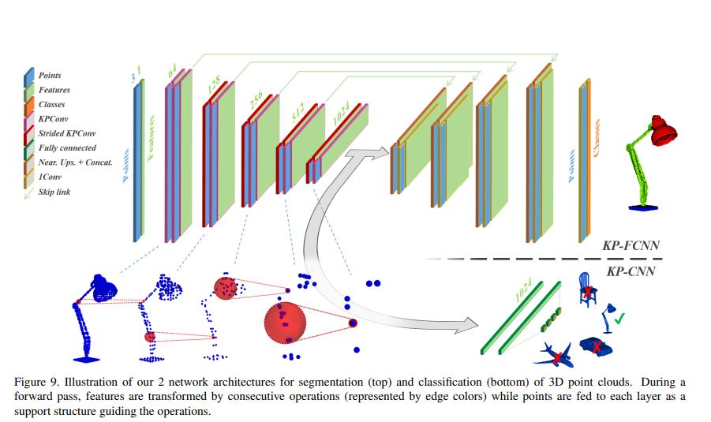

# KPConv

* 분류 : 3D segmentation
* 논문: "KPConv: Flexible and Deformable Convolution for Point Clouds"
* 저자: Hugues Thomas, Charles R. Qi, Jean-Emmanuel Deschaud, Beatriz Marcotegui, François Goulette, Leonidas J. Guibas
* 출판년도: 2019 (ICCV)
* 인용수 : 2858회
* github link : https://github.com/HuguesTHOMAS/KPConv-PyTorch  
* 특징 : 기존 CNN이 가지는 제한적인 기하학적 변형 처리 능력을 개선하여, 비정형적이거나 다양한 형태와 크기를 가진 물체를 보다 효과적으로 처리할 수 있도록 설계된 모델임

### 주요 특징:

1. 구 형태의 커널 : 반지름 r을 가지는 구 형태의 kernel을 제안함. 각 kerne의 point는 각각의 weights를 지니고 있음. Weights가 높은 곳에 위치한 point가 비중있게 학습됨.
 

2. point grid의 무게중심 다운샘플링 : 포인트가 kernel weights가 큰 부분에 위치하면 큰 feature 값을 갖게 됨. nearest neighborhood 방법으로 다시 업샘플링 하여 point 별 pred를 얻게 됨.  
 
