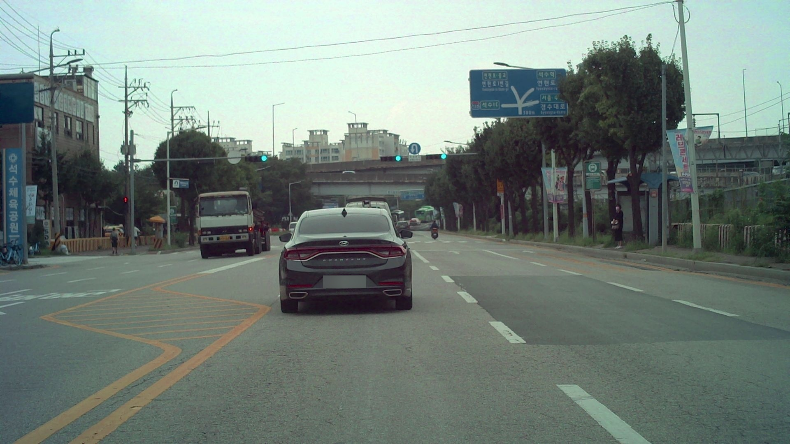
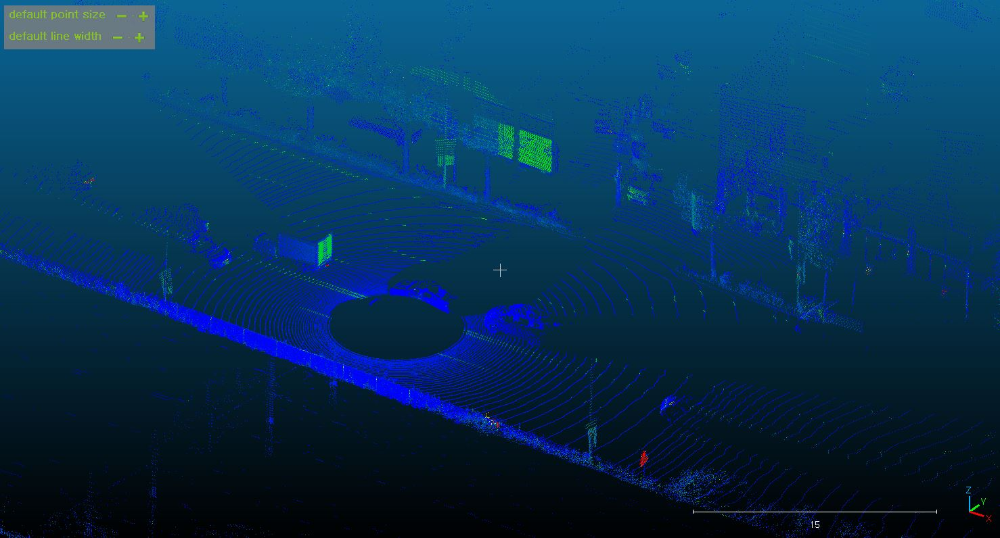
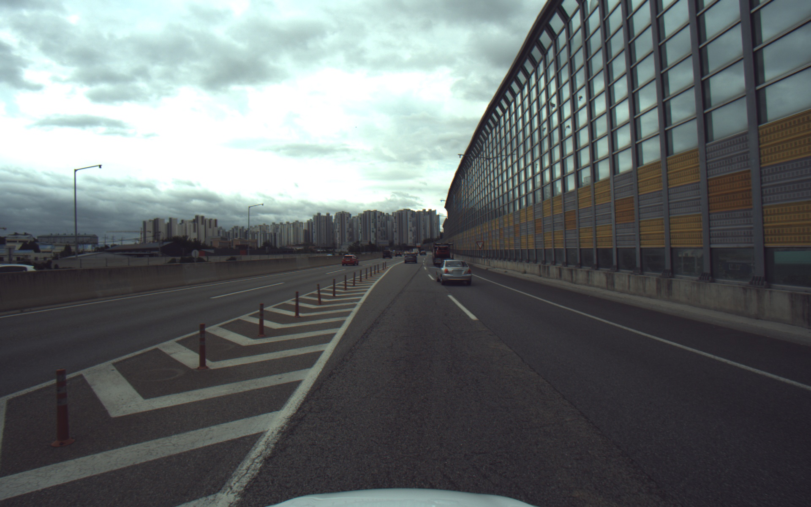
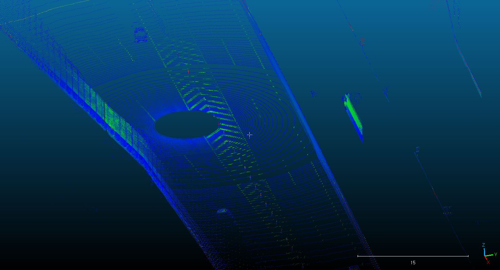
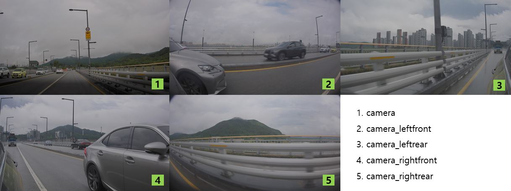
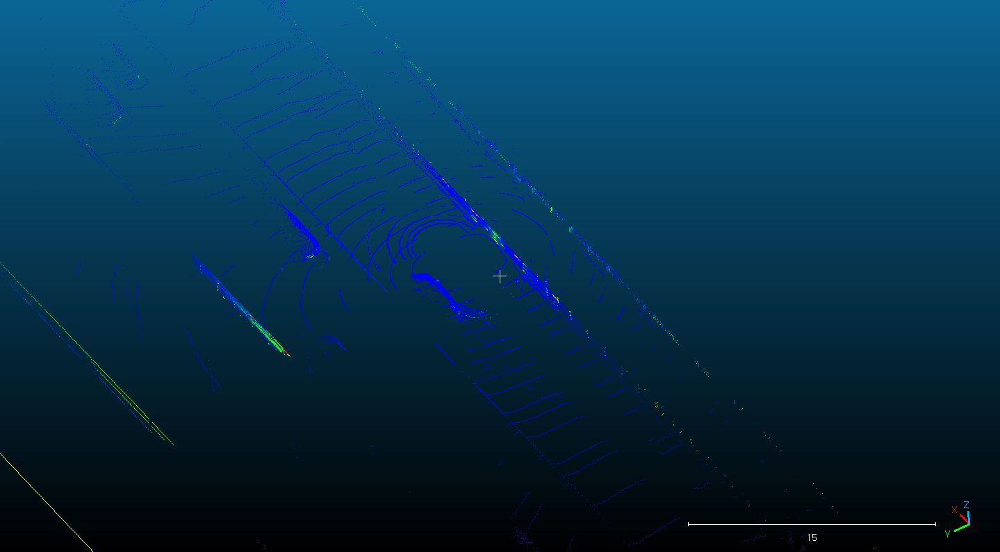
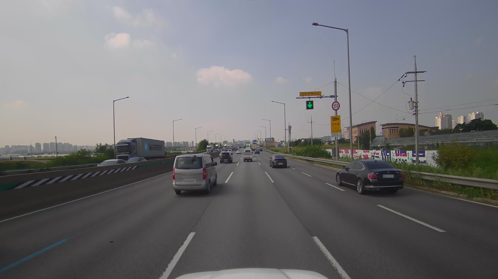

# Datasets

한국 환경의 데이터셋 위주로 서칭  

### 1. AHIUB 자율주행차의 다양한 주행환경에서의 신호등 신호정보 

* 소개 : 자율주행차가 정상 외 환경 (우천, 안개, 역광, 일출/일몰 등)의 주행 시에도
충분한 신호등 인식 인공지능 성능을 확보하기 위한 데이터  

 
 

||자율주행차의 다양한 주행환경에서의 신호등 신호정보 |
|-----|-----|
|다운로드|[link](https://www.aihub.or.kr/aihubdata/data/view.do?currMenu=115&topMenu=100&aihubDataSe=data&dataSetSn=71579)|
|구축년도|2022|
|용량|280.11 GB|
|데이터 형식|jpg (camera), pcd (lidar)|
|데이터 수량|원천데이터 ( Camera 100,000 + Meta 2,000 ) / 라벨링데이터 ( Camera 100,000 )|
|어노테이션|* 파일 유형 : json * 라벨링 유형 : 2D bounding box (tx, ty, bx, by)|
|객체 종류|신호등 유형 (vehicular_signal, pedestrian_signal, invisible_signal, unusual_signal)|
|객체 속성|객체 크기, 거리, 날씨, 주야간, 주행환경|
|특징|2d detection 가능 라이다가 있지만 좌표가 노말라이즈 되어있어서 크게 도움은 되지 않을듯|

### 2. AIHUB 4D 이미징 레이다 센서 기반의 동적 객체 인지 데이터  

* 소개 : 자율주행차에 설치된 4D 이미징 레이다 센서를 이용하여 고속도로와 도심 주행환경에서 수집된 동적객체 인식을 위한 데이터셋 구축  

 
 

||4D 이미징 레이다 센서 기반의 동적 객체 인지 데이터|
|-----|-----|
|다운로드|[link](https://www.aihub.or.kr/aihubdata/data/view.do?currMenu=115&topMenu=100&aihubDataSe=data&dataSetSn=71617)  |
|구축년도|2022|
|용량|4.19TB|
|데이터 형식|png (camera), pcd (lidar, radar)|
|데이터 수량|동적 객체 학습데이터 각 센서(카메라, LiDAR, 레이다)별 100만장 이상|
|어노테이션|*파일 유형 : txt, json * 라벨링 유형 : 3D, 2D bounding box|
|객체 종류|승용차, 버스, 트럭, 오토바이, 보행자, 특수목적차량, 자전거|
|객체 속성|기상 상황, 시간대|
|특징|라이다, 레이더가 있고 카메라 정보도 모두 있어서 캘리브레이션 및 3D detecetion 학습도 가능할듯|

### 3. AIHUB 승용 자율주행차 주간 도심도로 데이터

* 소개 : 실제로 운영되는 승용 자율주행 차량의 주간 도심도로에서의 센서 원본 데이터, 위치 데이터, 인지/판단/제어 결과 데이터를 구축하여 실제 도심환경에서 자울주행 차량이 마주하는 다양한 교통환경(신호등, 교차로, 횡단보도, 원형교차로 등)에 대한 자율주행 데이터를 구축  

 
 

||승용 자율주행차 주간 도심도로 데이터|
|-----|-----|
|다운로드|[link](https://www.aihub.or.kr/aihubdata/data/view.do?currMenu=115&topMenu=100&aihubDataSe=data&dataSetSn=71621)|
|구축년도|200|
|용량|295.16 GB|
|데이터 형식|jpg (camera), pcd (lidar)|
|데이터 수량|카메라 이미지, 라이다, 라벨링 셋 각각 16만장|
|어노테이션|2D segmentation, 2D/3D bounding box|
|객체 종류|* 바운딩박스 객체 : pedestrian, trafficLight, trafficSign, twoWheeler, vehicle  * 새그맨테이션 객체 : ambulance, background, bicycle, lueLane, bus, constructionGuide, crossWalk, curb, eogVehicle, fense, freespace, motorcycle, otherCar, pedestrian, policeCar, redLane, rider, roadMark, rubberCone, safetyZone, schoolBus, sideWalk, speedBump, stopLane, trafficDrum, trafficLight, trafficSign,  truck, twoWheeler, vehicle, warningTriangle, whiteLane, yellowLane|
|객체 속성|날씨, 날짜, 시간대, 수집차량 종류, 교통량, 차량 속도, 차선 폭|
|특징|카메라 이미지가 5방향으로 수집되어 있음 카메라 프로젝션 정보도 제공됨 2d/3d bbox가 함께 제공됨 라이다의 품질이 좋지는 않아 보임|

### 4. AIHUB 전국 도로시설물 영상정보 데이터

* 설명 : 전국의 고속도로, 국도, 지방도 4.5만KM에 존재하는 도로시설물 인식 데이터 구축  

 

||전국 도로시설물 영상정보 데이터|
|-----|-----|
|다운로드|[link](https://www.aihub.or.kr/aihubdata/data/view.do?currMenu=115&topMenu=100&aihubDataSe=data&dataSetSn=71786)|
|구축년도|2023|
|용량|1.66TB|
|데이터 형식|jpg(camera)|
|데이터 수량|원천 데이터 20만장 / 라벨링 데이터 20만개|
|어노테이션|* 파일 유형 : json * 라벨링 유형 : 2D bounding box or segmentation|
|객체 종류|도로안전시설물(16종), 도로관리시설물(8종), 교통관리시설물(8종), 기타(2종)  * 바운딩박스 가공시설물 : 시선유도표지, 갈매기표지, 표지병, 장애물 표적표지, 구조물 도색 및 빗금표지, 시선유도봉, 조명시설, 도로반사경, 과속방지턱, 교통신호기, 도로표지,안전표지, 도로명판, 긴급연락시설, CCTV, 도로전광표시, 도로이정표, 기둥, 가로재 * 세그멘테이션 가공 시설물 : 중앙분리대, 방호울타리, 충격흡수시설, 낙석방지망,낙석방지울타리,낙석방지 옹벽, 식생공법, 교량 , 터널, 지하차도, 고가차도, 입체교차로, 지하보도, 육교, 정거장|
|객체 속성|주행속도, 촬영방향, 위경도, 지역, 도로구분, 도시타입, 시설물 상태정보|
|특징|비교적 가까이에 있는 데이터만 라벨링 되어있음 객체 종류가 굉장히 다양함|

