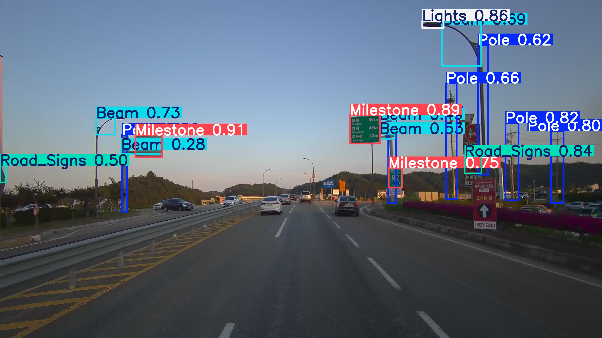
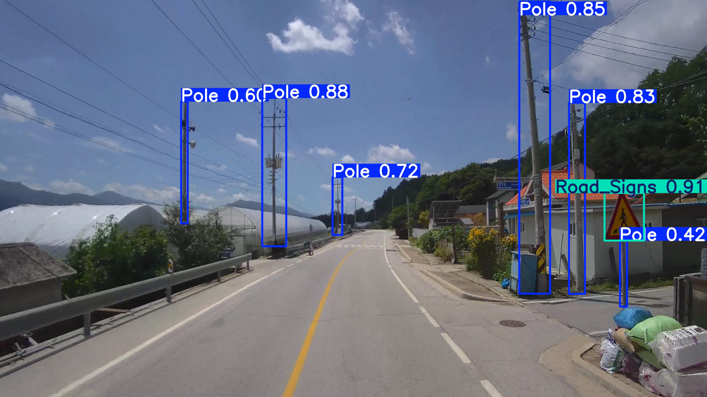
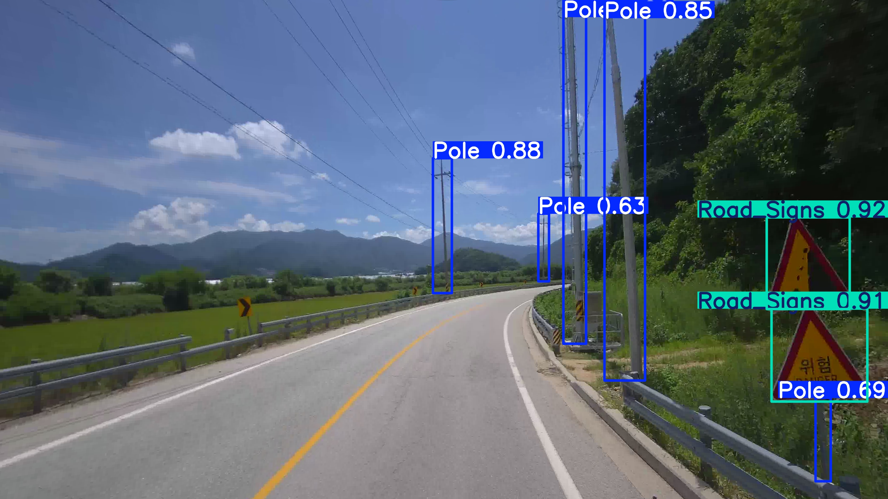
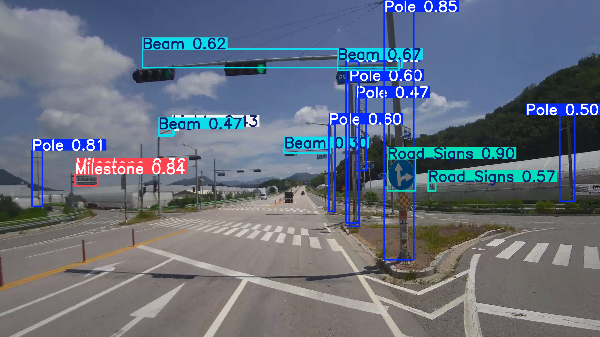
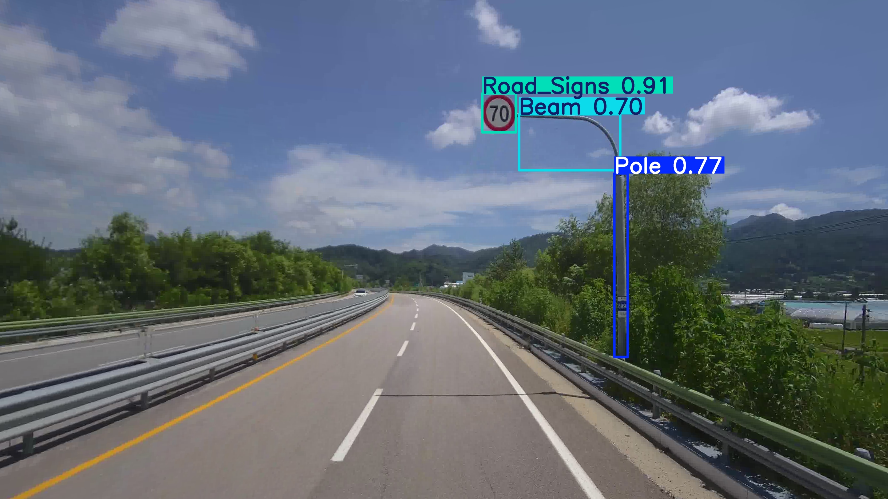
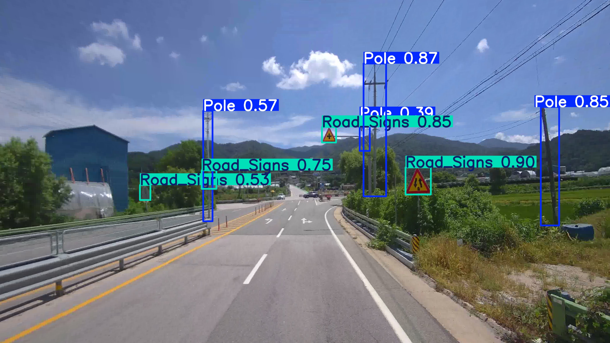
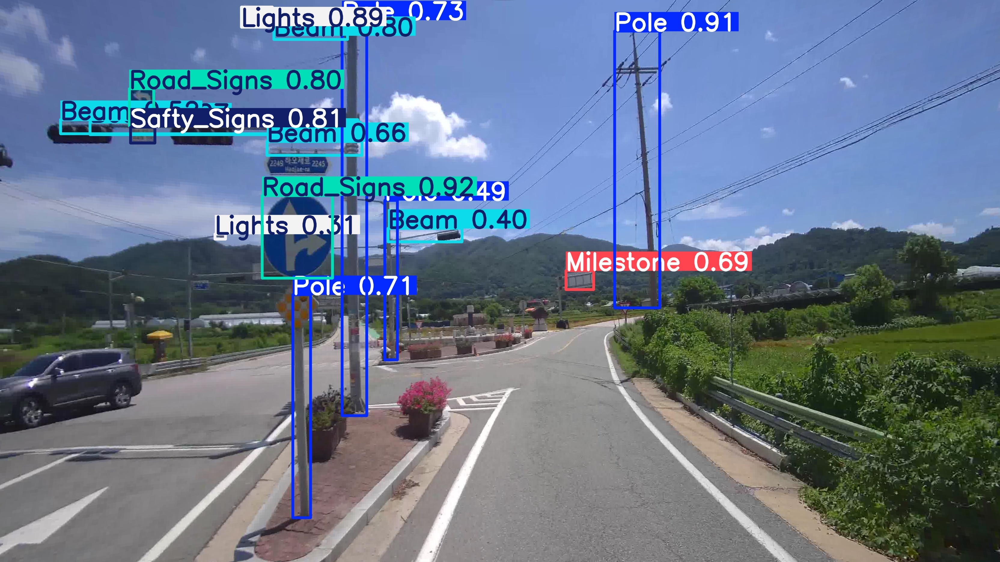
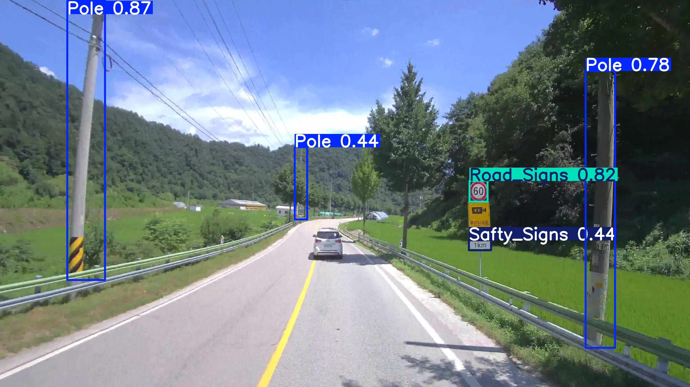
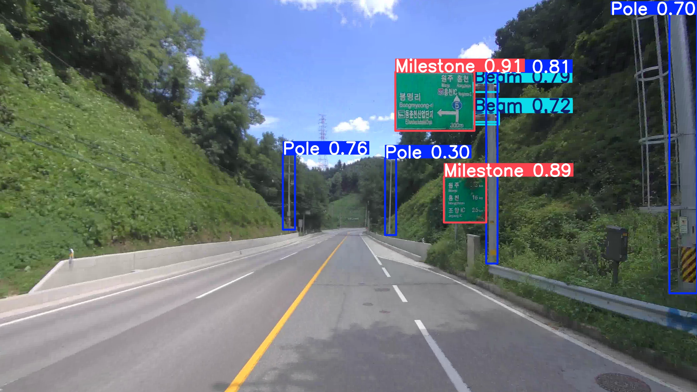
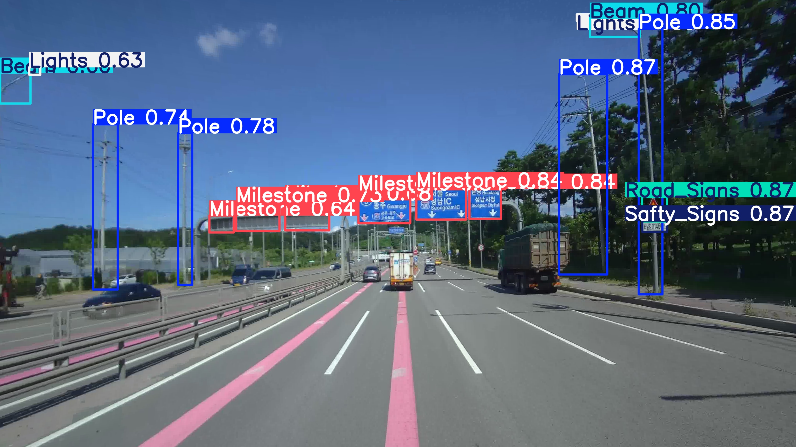

# 테스트 학습

* datasets : AIHUB 전국 도로시설물 영상정보 데이터 [(datasets.md 참고)](../dataset/info.md)
* model : YOLOv11 nano (coco pretrained)
* github : https://github.com/ultralytics/ultralytics  
* PC spec :  Intel(R) Core(TM) i7-13700F / nvidia geforce RTX 3060 x 1장

### 학습 데이터셋  

지방 비도시부 데이터로만 학습

||train|valid|
|-----|-----|-----|
| 0: Pole        |57055  |7562 |
| 1: Beam        |15563  |4569 |
| 2: Lights      |5533   |1768 |
| 3: Road_Signs  |14872  |2705 |
| 4: Safty_Signs |1053   |251  |
| 5: Display     |202    |131  |
| 6: Milestone   |10963  |2284 |


* datasetes.yaml
```
path: ../../datasets/ 
train: Training # train images 
val: Validation # val images 

# Classes
names:
  0: Pole
  1: Beam
  2: Lights
  3: Road_Signs
  4: Safty_Signs
  5: Display
  6: Milestone
```

<br>

  # 학습 결과

||mAP50|
|-----|-----|
| 0: Pole        |0.763 |
| 1: Beam        |0.485 |
| 2: Lights      |0.411 |
| 3: Road_Signs  |0.675 |
| 4: Safty_Signs |0.433 |
| 5: Display     |0.402 |
| 6: Milestone   |0.695 |
|total mAP       |0.552 | 


### TEST 데이터셋 결과

학습과 평가에 사용되지 않은 데이터셋으로 모델 predict 결과 그려보기  

--> 비교적 학습이 잘 되었음을 알 수 있음.
--> Pole처럼 형상이 가느다랗고 긴 객체도 잘 학습이 됨.  


<br>
<br>
<br>
<br>
<br>
<br>
<br>
<br>
<br>
<br>

